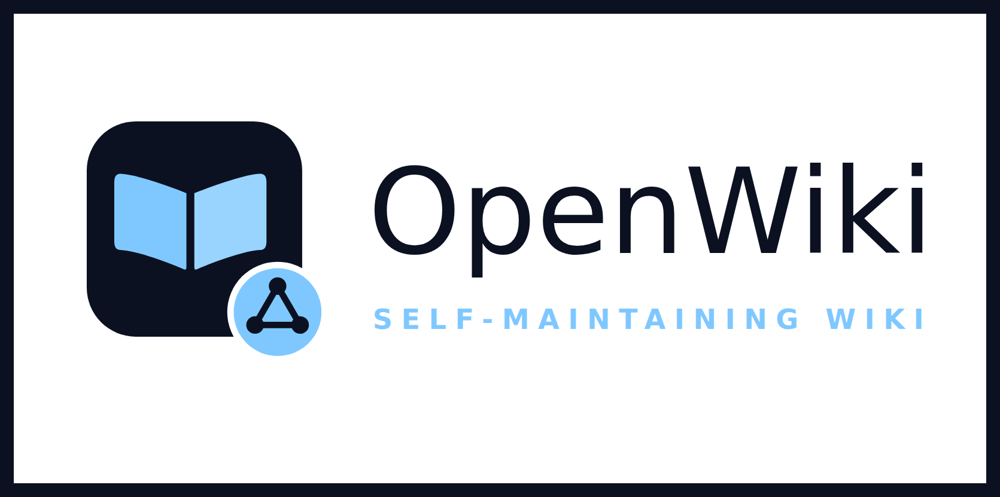
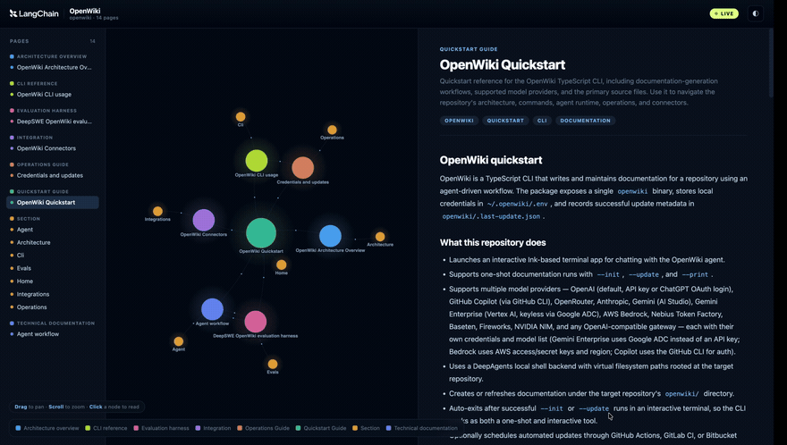

<!-- markdownlint-disable MD033 MD041 -->

# HWJ Wiki

HWJ Wiki 是基于 OpenWiki 的个人工作流发行版。它保留上游 Wiki 生成引擎和完整
Git 历史，并增加本地 LiteLLM（`localhost:4001`）、默认中文、
Pi/Codex/Antigravity 历史、豆包导出、隐私脱敏和项目踩坑索引。

个人历史通过本地待处理队列分批整理：一次 `personal --init/--update` 会按
Pi、Codex、Antigravity、豆包轮询处理到 backlog 清空，但每次模型调用仍只
接收一个约 100 条、80KB 的受控批次。每批通过质量门后立即确认；中断或网关
故障时状态为 `partial`，重新运行会从最后成功批次继续。`--print` 在 partial
时返回退出码 `2`，方便脚本区分“仍需续跑”和真正的 complete。

个人模式先把脱敏历史提取成带 `stableKey`、`sourceRefs`、可信度和时效标记的
结构化候选，再用严格限定的目标提示词交给原 OpenWiki Agent 合并。安全降级也
只消费结构化候选，并执行同一套 OKF、索引、断链、去重、来源和敏感信息检查；
降级页面进入独立复核队列，复核完成前不会误报 `complete`。个人候选提取默认关闭
模型客户端的额外重试，由适配层统一控制分片和重试，避免网关抖动被多层重试放大；
确实需要时可设置 `OPENWIKI_PERSONAL_EXTRACTION_PROVIDER_RETRIES`（非负整数）。

```bash
npm install --global hwj-wiki
openwiki code --update
openwiki personal --update
```

也可以安装 GitHub 开发版本：

```bash
npm install --global github:hwj123hwj/hwj-wiki
```

没有显式 Provider 配置时会连接 `http://localhost:4001/v1`，默认模型为
`coding`、默认语言为中文。显式 Provider、模型、语言和网关 Key 始终优先。
个性化设计见[实现基线](./docs/openwiki_customization_plan.md)，上游同步见
[同步说明](./docs/upstream-sync.md)。

> 上游项目：[langchain-ai/openwiki](https://github.com/langchain-ai/openwiki)

## OpenWiki upstream capabilities

<div align="center">



### The self-maintaining wiki. Built for agents, explored by humans.

[](https://www.npmjs.com/package/hwj-wiki)
[](https://www.npmjs.com/package/hwj-wiki)
[](https://nodejs.org)
[](./LICENSE)
[](https://github.com/langchain-ai/deepagentsjs)

<a href="https://trendshift.io/repositories/70339?utm_source=trendshift-badge&amp;utm_medium=badge&amp;utm_campaign=badge-trendshift-70339" target="_blank" rel="noopener noreferrer"></a>

</div>

OpenWiki is a CLI that writes and maintains a wiki for your codebase or your personal knowledge. An agent reads your sources, synthesizes a linked Markdown wiki you own, and keeps it current on every change. It is built for agents to read as memory, and it ships an interactive visualizer for humans to explore.

**OpenWiki gives you:**

- **Agent-written docs** that stay accurate, generated by a [Deep Agents](https://github.com/langchain-ai/deepagentsjs) documentation agent.
- **Two modes:** a `code` wiki for a repository, or a `personal` wiki for your own knowledge.
- **Twelve model providers** out of the box, from OpenAI and Anthropic to Bedrock, Gemini, and any OpenAI-compatible gateway.
- **Built-in connectors** for Notion, Slack, Gmail, X, Web Search, Hacker News, and local git repositories.
- **An interactive visualizer** that turns any wiki into a live, explorable node graph.
- **Self-updating** through GitHub Actions, GitLab CI, or Bitbucket Pipelines.
- **Open Knowledge Format** ([OKF v0.1](https://github.com/GoogleCloudPlatform/knowledge-catalog/blob/main/okf/SPEC.md)) output with validated Mermaid diagrams.

## 🎉 What's new

- **Interactive visualizer:** turn any wiki into a live, explorable node graph with a side-by-side Markdown reader.
- **`.openwikiignore`:** keep generated, private, or irrelevant paths out of doc runs with familiar gitignore-style rules.
- **Multilingual wikis:** generate docs in another language with `--language <locale>`, while code and identifiers stay canonical.
- **LangSmith connector:** pull recent LangSmith traces (tool calls, outcomes, latency) into a code wiki.
- **GitHub Copilot provider:** reuse an existing Copilot subscription for inference, no separate API key required.

## Quick start

Install the CLI:

```sh
npm install -g hwj-wiki
```

Generate a wiki for the current repository. The first run walks you through picking a provider, key, and model, then writes docs to `openwiki/`:

```sh
openwiki --init
```

Keep it current automatically by adding a scheduled CI job that opens a docs PR on every change:

- **GitHub Actions:** copy [`openwiki-update.yml`](./examples/openwiki-update.yml) into `.github/workflows/openwiki-update.yml`.
- **GitLab CI:** copy [`openwiki-update.gitlab-ci.yml`](./examples/openwiki-update.gitlab-ci.yml) into `.gitlab-ci.yml` or include it from your pipeline.
- **Bitbucket Pipelines:** copy [`openwiki-update.bitbucket-pipelines.yml`](./examples/openwiki-update.bitbucket-pipelines.yml) into `bitbucket-pipelines.yml`, then schedule the `openwiki-update` pipeline.

> [!NOTE]
> On Windows, install with a Node.js package manager (`npm install -g hwj-wiki` or `pnpm add -g hwj-wiki`). Installing with `bun` can fall back to compiling the `better-sqlite3` native dependency, which needs Visual Studio Build Tools with the Desktop development with C++ workload.

## Two modes

OpenWiki runs in one of two modes. Bare `openwiki`, `openwiki --init`, and `openwiki --update` default to **code** mode; add the `personal` positional (or `--mode personal`) for the personal brain.

| Mode                 | Documents              | Writes to               | Get started                |
| -------------------- | ---------------------- | ----------------------- | -------------------------- |
| **Code** _(default)_ | The current repository | `openwiki/` in the repo | `openwiki --init`          |
| **Personal**         | Your connected sources | `~/.openwiki/wiki`      | `openwiki personal --init` |

By default the CLI stays open after a run so you can send follow-up messages. Add `-p` / `--print` for a one-shot, non-interactive run that prints the final output and exits. `--init` and `--update` auto-exit on success in an interactive terminal, so the same command works one-shot or interactively.

## Explore your wiki

Turn any wiki into an interactive node graph with a live, side-by-side Markdown reader:

```sh
openwiki visualize
```

<div align="center">
  
</div>

This serves `./openwiki` on a local loopback address (`127.0.0.1`, never exposed on the network) and opens your browser to the graph. Edits to the wiki files are picked up automatically while the server runs. Pass a path to visualize a different directory, `--port <port>` to choose the port (it increments on conflict; default `4321`), and `--no-open` to leave the browser alone:

```sh
openwiki visualize openwiki --port 4400 --no-open
```

> [!NOTE]
> The page loads its graph, Markdown, and diagram libraries from a public CDN, so an internet connection is required even though the server itself is local. Press Ctrl-C to stop it.

## Connect your sources

In `personal` mode, OpenWiki ingests knowledge from the tools you already use, synthesizing them into your local wiki. First-run onboarding offers setup for **local git repositories, the LLM Gateway, Notion, Gmail, X/Twitter, Web Search, and Hacker News**.

During an ingestion run, deterministic connector tools write raw data and manifests under `~/.openwiki/connectors/<connector>/raw/`, then source-specific agent runs synthesize the wiki under `~/.openwiki/wiki/`. You can configure the same connector more than once (for example one Web Search source for AI research and another for NBA news); OpenWiki stores them as separate instances like `web-search-1` and `web-search-2`.

```sh
openwiki auth notion        # run a local browser OAuth flow for a provider
openwiki ingest all         # run every configured source
openwiki ingest web-search  # run one connector's sources
openwiki ingest gateway     # import the next Gateway archive page
```

<details>
<summary><b>Connector details and OAuth</b></summary>

<br/>

- `git-repo` reads configured local repository paths and writes compact manifests.
- `x` uses the X API directly with OAuth user-context credentials for home timeline, user posts, mentions, bookmarks, and list posts.
- `notion` targets the hosted Notion MCP server, so authenticate through Notion OAuth rather than pasting a token.
- `google` uses the Gmail API directly with OAuth user credentials to fetch recent mail.
- `web-search` uses Tavily through LangChain and requires `TAVILY_API_KEY`.
- `hackernews` uses the public Hacker News feed and search APIs, with no credentials required.
- `gateway` reads the sanitized JSONL export from `/admin/archives/export`, stores raw connector data under `~/.openwiki/connectors/gateway/raw/`, and advances a durable cursor only after the raw page is written. It requires `OPENWIKI_GATEWAY_ADMIN_TOKEN` (the admin token is never put in connector config or generated wiki pages).

For a local Gateway, the default endpoint is `http://127.0.0.1:4001`. To use another endpoint, set `OPENWIKI_GATEWAY_URL` or write a connector config without the secret:

```sh
export OPENWIKI_GATEWAY_URL="https://gateway.example.com"
export OPENWIKI_GATEWAY_ADMIN_TOKEN="<admin-token>"
mkdir -p ~/.openwiki/connectors/gateway
cat > ~/.openwiki/connectors/gateway/config.json <<'JSON'
{
  "baseUrl": "https://gateway.example.com",
  "adminTokenEnv": "OPENWIKI_GATEWAY_ADMIN_TOKEN",
  "enabled": true,
  "limit": 100
}
JSON
openwiki ingest gateway
```

The connector can be attached to OpenWiki's existing recurring ingestion schedule through personal-mode onboarding. Failed requests and malformed export pages keep the previous cursor so the next run retries the same page.

`openwiki auth <provider>` runs a local browser OAuth flow, saves returned tokens into `~/.openwiki/.env`, creates connector config when possible, and discovers MCP tools for MCP-backed providers. Slack and Gmail require app client credentials to already be set in that file; Notion uses dynamic client registration for hosted MCP; X uses OAuth 2.0 with PKCE. `openwiki auth configure <provider>` and `openwiki auth tools <provider>` are advanced retry commands.

Connector secrets are referenced by env var name and stored in `~/.openwiki/.env`; connector config files never contain raw secret values.

**Slack OAuth tunnel.** `openwiki ngrok start` starts an ngrok tunnel with a random HTTPS forwarding URL, reads ngrok's local inspection API, appends `/callback`, and saves `OPENWIKI_HTTPS_OAUTH_REDIRECT_URI` automatically. Register the printed callback URL in Slack. With a fixed domain, run `openwiki ngrok start https://<your-ngrok-domain>`.

</details>

### LangSmith connector (code mode)

The connectors above feed a `personal` wiki. The **LangSmith** connector instead enriches a `code` wiki: it pulls recent LangSmith traces (tool calls, outcomes, and latency) for the projects you choose through the official LangSmith SDK, so a repository's docs reflect how its code actually behaves at runtime, not just what the source says.

Configure it during `openwiki --init` in `code` mode. From the source menu, add LangSmith, pick your workspace region (US or EU), and list the projects to document. OpenWiki writes a committed `openwiki/.langsmith.json` that names the workspaces and projects (never the key itself), so every teammate and CI run documents the same set. The API key is read from the environment:

```sh
OPENWIKI_LANGSMITH_API_KEY="<your-langsmith-key>"
```

Locally the setup wizard saves this to `~/.openwiki/.env`. In CI, set it as a repository secret and export it for the run.

> [!NOTE]
> A LangSmith key is workspace- and region-bound. To document projects across more than one workspace, add an entry per workspace, each with its own key named `OPENWIKI_LANGSMITH_API_KEY_2`, `OPENWIKI_LANGSMITH_API_KEY_3`, and so on. The connector only talks to the official US (`api.smith.langchain.com`) and EU (`eu.api.smith.langchain.com`) hosts.

## How it stays yours

Everything OpenWiki writes is plain Markdown you own and version alongside your code.

- **Agents read it as memory.** On each `code` run, OpenWiki maintains an `AGENTS.md` and `CLAUDE.md` at the repo root that point your coding agent at the wiki. It only rewrites its own `<!-- OPENWIKI:START -->…<!-- OPENWIKI:END -->` block and leaves the rest of each file untouched.
- **You set the brief.** Repository-specific instructions live in `openwiki/INSTRUCTIONS.md`, a user-authored file OpenWiki reads for scope and priorities but never rewrites during normal runs.
- **No-op runs are free.** After a run, OpenWiki snapshots the `openwiki/` directory and only records new metadata when something actually changed, so scheduled workflows never churn.
- **Local, private config.** Provider choice, keys, and optional LangSmith tracing are saved to `~/.openwiki/.env` on your machine.

## Open Knowledge Format

OpenWiki emits [Google Open Knowledge Format (OKF) v0.1](https://github.com/GoogleCloudPlatform/knowledge-catalog/blob/main/okf/SPEC.md) bundles in both modes, so your wiki is portable to any OKF-aware tool.

- Every concept document carries YAML front matter with a non-empty `type`; all other standard fields are optional.
- Standard Markdown links between concept documents express their relationships.
- `index.md` and `log.md` are reserved documents rather than concepts. The root index declares `okf_version: "0.1"`.
- Valid `timestamp` values and producer-defined extension fields are preserved across updates and migrations.

## Diagrams

OpenWiki embeds **Mermaid** diagrams wherever they make a concept clearer than prose: sequence diagrams for runtime flows, ER diagrams for data models, state diagrams for lifecycles, and flowcharts for control flow. Diagrams are grounded in the inspected source, added where they add signal, and kept in sync on `--update`. No configuration is required.

After each run, OpenWiki validates every `mermaid` fence. A diagram that fails validation is converted in place to a plain `text` fence with a short comment explaining why, so it degrades to readable text instead of a broken block. The next `--update` finds that comment and repairs the diagram, so quality recovers over successive runs.

> [!TIP]
> By default OpenWiki runs a lightweight, zero-dependency check that catches common breakages. For authoritative validation that matches exactly what GitHub renders, install the Mermaid parser wherever you run OpenWiki (for example in your scheduled workflow), and no broken diagram will ship:
>
> ```sh
> npm install mermaid jsdom
> ```

## Model providers

The onboarding default is OpenAI with `gpt-5.6-terra`. Every provider includes preset model options plus support for custom model IDs, and stores its credentials in `~/.openwiki/.env`.

| Provider                                                     | Credential                              |
| ------------------------------------------------------------ | --------------------------------------- |
| **OpenAI** _(default)_                                       | `OPENAI_API_KEY`                        |
| **OpenAI (ChatGPT login)**                                   | Browser sign-in, uses your ChatGPT plan |
| **Anthropic**                                                | `ANTHROPIC_API_KEY`                     |
| **Gemini** (AI Studio)                                       | `GEMINI_API_KEY`                        |
| **Gemini Enterprise** (Vertex AI)                            | Google ADC, keyless                     |
| **AWS Bedrock**                                              | IAM credentials                         |
| **GitHub Copilot**                                           | GitHub CLI session                      |
| **OpenRouter**                                               | `OPENROUTER_API_KEY`                    |
| **Nebius / Fireworks / Baseten / NVIDIA NIM**                | Provider API key                        |
| **OpenAI-compatible** (LiteLLM, Ollama, LM Studio, gateways) | Base URL + key                          |

<details>
<summary><b>GitHub Copilot</b></summary>

<br/>

The GitHub Copilot provider routes inference through the OpenAI-compatible Copilot API (`https://api.githubcopilot.com`), so teams can reuse an existing Copilot subscription instead of provisioning a separate inference key.

1. Select `GitHub Copilot` during `openwiki --init`. If you have an active [GitHub CLI](https://cli.github.com) session, OpenWiki detects it and offers to reuse it. Otherwise, press <kbd>Tab</kbd> at the credential prompt to run `gh auth login` and sign in.
2. Choose a model (for example `gpt-5.5`).

OpenWiki leaves the token in the GitHub CLI's own credential store. For CI or another headless environment, set `COPILOT_API_KEY` to a GitHub **OAuth token**. Personal Access Tokens are rejected by the Copilot API for third-party integrations. The local config can stay token-free:

```env
OPENWIKI_PROVIDER="copilot"
OPENWIKI_MODEL_ID="gpt-5.5"
```

In CI, set the `COPILOT_API_KEY` repository secret and export `OPENWIKI_PROVIDER=copilot`.

</details>

<details>
<summary><b>AWS Bedrock</b></summary>

<br/>

The `bedrock` provider calls foundation models on AWS Bedrock using IAM credentials rather than a single vendor key:

```bash
OPENWIKI_PROVIDER=bedrock
BEDROCK_AWS_ACCESS_KEY_ID=your-access-key-id
BEDROCK_AWS_SECRET_ACCESS_KEY=your-secret-access-key
BEDROCK_AWS_REGION=us-east-1
OPENWIKI_MODEL_ID=anthropic.claude-sonnet-5
```

When explicit Bedrock credentials are not set, OpenWiki uses the AWS SDK default credential provider chain (OIDC/web identity, IAM roles, AWS profiles, ECS/EC2). The region resolves from `BEDROCK_AWS_REGION`, `AWS_REGION`, or `AWS_DEFAULT_REGION`. Available model IDs depend on which foundation models you have enabled in your account and region, so there is no preset list; paste the Bedrock model ID directly.

Some newer models only accept on-demand invocation through a cross-region inference profile. If you see `ValidationException: Invocation of model ID ... with on-demand throughput isn't supported`, prefix the model ID with the profile's region code, for example `us.anthropic.claude-sonnet-5`. Your IAM policy then also needs `bedrock:InvokeModel` / `InvokeModelWithResponseStream` on both the `foundation-model` and `inference-profile` resource types.

</details>

<details>
<summary><b>Gemini (AI Studio) and Gemini Enterprise (Vertex AI)</b></summary>

<br/>

**Gemini (AI Studio)** runs Google's Gemini models with a single API key:

```bash
OPENWIKI_PROVIDER=gemini
GEMINI_API_KEY=your-ai-studio-key
```

**Gemini Enterprise** runs models from the Gemini Enterprise Model Garden (formerly Vertex AI): Google's Gemini/Gemma, Anthropic's Claude, and partner/open-weight models (Llama, Mistral, DeepSeek, Qwen). It routes each model ID to the right API surface automatically and uses no API key. Authentication happens with Google Application Default Credentials (ADC):

- a service account key file via `GOOGLE_APPLICATION_CREDENTIALS=/path/to/key.json`,
- user credentials from `gcloud auth application-default login`, or
- workload identity when running on Google Cloud or in CI.

```bash
OPENWIKI_PROVIDER=gemini-enterprise
GOOGLE_CLOUD_PROJECT=your-gcp-project
GOOGLE_CLOUD_LOCATION=global   # optional, defaults to global
```

Set `OPENWIKI_MODEL_ID` to any Model Garden model. Gemini and Claude ship as presets; partner models are reached by pasting their ID (for example `publishers/meta/models/llama-3.3-70b-instruct-maas`). The credentials need Vertex AI access (`roles/aiplatform.user`), and the models must be enabled in the Model Garden. The `global` endpoint serves Gemini and Claude with the best availability; set `GOOGLE_CLOUD_LOCATION` to a regional endpoint for data residency, and always set it explicitly for region-specific partner (MaaS) models.

For CI, authenticate before the update job runs (for example with [`google-github-actions/auth`](https://github.com/google-github-actions/auth)) and set `OPENWIKI_PROVIDER=gemini-enterprise` and `GOOGLE_CLOUD_PROJECT` in the job environment.

</details>

<details>
<summary><b>OpenAI (ChatGPT login)</b></summary>

<br/>

The `openai-chatgpt` provider calls OpenAI's Codex backend using your ChatGPT subscription instead of a metered API key, drawing on your Plus/Pro/Team plan's included Codex usage. It serves the same model list as the `openai` provider.

```bash
OPENWIKI_PROVIDER=openai-chatgpt openwiki code --init
# or
OPENWIKI_PROVIDER=openai-chatgpt openwiki personal --init
```

The wizard opens `https://auth.openai.com` in your browser (and prints the URL for headless/SSH use). After you sign in, OpenWiki captures the OAuth callback, shows the signed-in email and plan, and continues to model selection. It stores the access token, refresh token, expiry, account id, email, and plan in `~/.openwiki/.env`. These are managed for you and the access token is refreshed automatically, so you normally never edit them by hand. Treat the refresh token like a password.

</details>

<details>
<summary><b>OpenAI-compatible endpoints (LiteLLM, Ollama, LM Studio, gateways)</b></summary>

<br/>

The `openai-compatible` provider targets any OpenAI-compatible chat-completions endpoint via a required base URL. Set the model ID to whatever the endpoint exposes.

```bash
# Hosted gateway (for example Requesty, which fronts many upstream providers)
OPENWIKI_PROVIDER=openai-compatible
OPENAI_COMPATIBLE_API_KEY=your-gateway-key
OPENAI_COMPATIBLE_BASE_URL=https://router.requesty.ai/v1
OPENWIKI_MODEL_ID=openai/gpt-5.5
```

```bash
# Ollama, after `ollama serve` and `ollama pull llama3.2`
OPENWIKI_PROVIDER=openai-compatible
OPENAI_COMPATIBLE_API_KEY=ollama
OPENAI_COMPATIBLE_BASE_URL=http://localhost:11434/v1
OPENWIKI_MODEL_ID=llama3.2
```

```bash
# LM Studio, after starting the local server from the Developer tab
OPENWIKI_PROVIDER=openai-compatible
OPENAI_COMPATIBLE_API_KEY=lm-studio
OPENAI_COMPATIBLE_BASE_URL=http://localhost:1234/v1
OPENWIKI_MODEL_ID=your-loaded-model-id
```

Some local servers ignore the API key value, but OpenWiki still requires `OPENAI_COMPATIBLE_API_KEY` because the client expects one.

</details>

<details>
<summary><b>Alternative base URLs, OpenRouter pinning, and retries</b></summary>

<br/>

**Alternative base URLs.** Route a provider at a self-hosted or proxied gateway by setting its base URL alongside its key: `ANTHROPIC_BASE_URL`, `OPENAI_BASE_URL`, `BASETEN_BASE_URL`, `FIREWORKS_BASE_URL`, `NVIDIA_BASE_URL`, or `COPILOT_BASE_URL`. The `openai` provider routes tool calls through the Responses API (`/v1/responses`), which is useful for gateways that expose it.

```bash
OPENWIKI_PROVIDER=anthropic
ANTHROPIC_API_KEY=your-key
ANTHROPIC_BASE_URL=https://your-gateway.example.com/anthropic
```

**OpenRouter provider pinning.** When OpenRouter serves a model through multiple upstreams, restrict routing with a provider or comma-separated allowlist:

```bash
OPENWIKI_PROVIDER=openrouter
OPENROUTER_API_KEY=your-key
OPENWIKI_OPENROUTER_PROVIDER_ONLY=Novita
```

**Retry attempts.** OpenWiki uses LangChain's retry handling for transient provider errors. Override the retry count (default 3) with `OPENWIKI_PROVIDER_RETRY_ATTEMPTS=3` (a positive integer).

</details>

> [!NOTE]
> If there is an inference provider or model you would like to see added, please open a PR.

## Ignoring paths

Create a `.openwikiignore` file in the repository root to keep generated docs from reading or describing private, generated, or irrelevant paths. The syntax supports comments, blank lines, `*` and `**` globs, directory rules, and `!` negation:

```gitignore
secrets/
*.log
!logs/keep.log
```

When `.openwikiignore` has active rules, OpenWiki filters filesystem discovery and restricts shell execute so ignored paths stay out of the run. This is a read boundary: ignored paths are never read, scanned, or reproduced in the docs. It does not guarantee a topic is never mentioned, since the agent may still infer an ignored area from other allowed evidence such as tests, the README, or commit messages.

## Command reference

```sh
openwiki                         # interactive chat, code mode, current repo
openwiki personal                # interactive chat, personal brain
openwiki "generate docs"         # start with an initial request
openwiki -p "what can you do?"   # one-shot, print, and exit
openwiki --init                  # initialize code docs (personal: openwiki personal --init)
openwiki --update                # update code docs (personal: openwiki personal --update)
openwiki visualize               # interactive graph + live reader
openwiki auth <provider>         # authenticate a connector (slack, gmail, x, notion)
openwiki ingest <source>         # run connector ingestion (all, or a connector/instance)
openwiki search <query>          # deterministic unified Markdown knowledge search
openwiki --help                  # full help
```

`openwiki search` searches the generated personal wiki plus configured Markdown roots. Use `--json` for HwjCode or other agents, and `--root PATH` for an external knowledge repository such as agent-lessons:

```sh
OPENWIKI_AGENT_LESSONS_ROOT="$HOME/agent-lessons" \
openwiki search "gateway archive" --json --limit 10
```

The search path is read-only and does not invoke a model. It skips connector `raw/` and private compiler-input directories, bounds file size, and redacts secret-like values from snippets.

In chat, `/api-key` updates the current provider key and `/langsmith-key` updates or clears LangSmith tracing credentials, both with masked prompts.

## Telemetry

OpenWiki collects anonymous, aggregate usage data to understand how the tool is used and improve it. Telemetry is on by default and easy to turn off.

**Collected** on a single `openwiki_run` event, keyed by a random install ID in `~/.openwiki/install-id`: the command (init / update), the outcome (success / failure / no-op) with a coarse error category on failure (never the message), and at setup only, the brain mode, model provider, and configured connector names.

**Never collected:** file contents, repository data or names, credentials, prompts, model output, connector payloads, error messages, file paths, URLs, model IDs, run duration, or your IP address. Interactive chat, `auth`, and `ingest` are not recorded. Scheduled/CI runs are tagged as anonymous reliability data under a shared CI identifier and never counted as installs.

Opt out with either environment variable, or add the first line to `~/.openwiki/.env` to disable permanently:

```sh
export OPENWIKI_TELEMETRY_DISABLED=1
export DO_NOT_TRACK=1   # cross-tool standard
```

To see exactly what a run would send, add `--telemetry-file=<path>` to any run.

## Contributing

Contributions are welcome. Please read [CONTRIBUTING.md](./CONTRIBUTING.md) before opening a PR. We intentionally keep PRs tightly scoped to one change each, and PRs that bundle unrelated changes may be closed with a request to split them.

## License

[MIT](./LICENSE)
